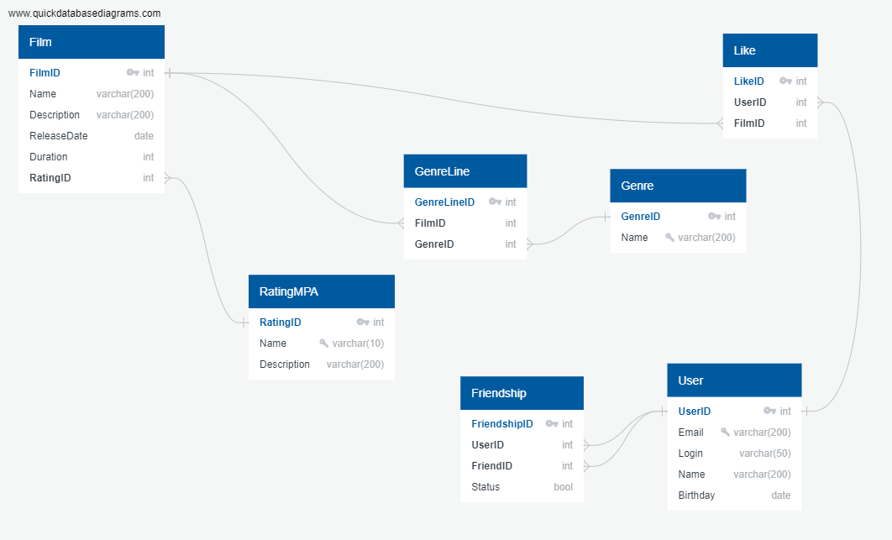

# java-sprint11-hw

# Примеры запросов: 
Выбрать топ 10 самых популярных фильмов:

SELECT Film.Name, COUNT(FilmID) 

FROM Film 

INNER JOIN Like ON Film.FilmID = Like.FilmID

GROUP BY FilmID, Film.Name

LIMIT 10

Выбрать все фильмы: 

SELECT * FROM Film

Выбрать фильмы по жанру:

SELECT Film.FilmID
	,Film.Name
	,Film.ReleaseDate
	,Genre.Name
FROM Film
INNER JOIN GenreLine ON GenreLine.FilmID = Film.Film.ID
INNER JOIN Genre ON GenreLine.GenreID = Genre.GenreID
WHERE Genre.Name = 'Триллер'

Выбрать друзей пользователя 5:

DECLARE vCurrentUserID INTEGER := 5
SELECT * 
FROM User 
INNER JOIN Friendship ON Friendship.FriendID = User.UserID
WHERE Friendship.Status = true AND Friendship.UserID = vCurrentUserID

Выбрать топ 10 самых популярных фильмов среди моих друзей:

DECLARE vCurrentUserID INTEGER := 5
SELECT Film.Name, COUNT(Like.FilmID) 
FROM Film 
INNER JOIN Like ON Film.FilmID = Like.FilmID
WHERE Like.UserID IN (
		SELECT Friendship.UserID 
		FROM Friendship
		WHERE Friendship.Status = true AND Friendship.UserID = vCurrentUserID
	)
GROUP BY Like.FilmID, Film.Name
LIMIT 10
